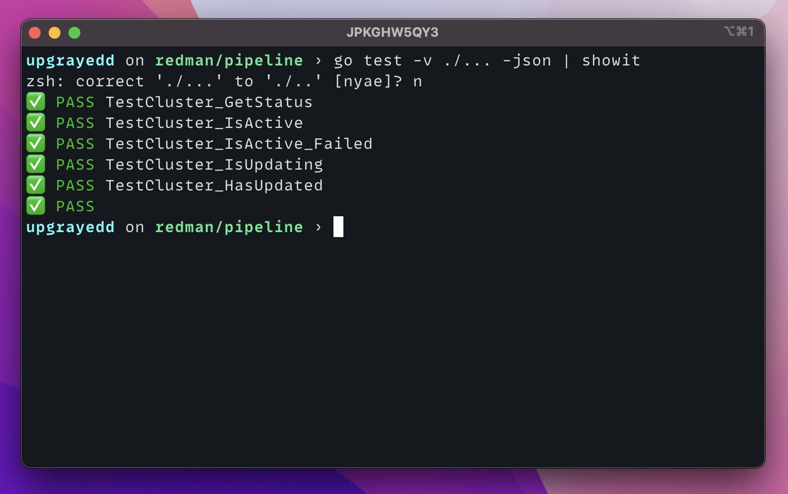

# showit



Simple example of how to transform go testing output into an emojified report

## Installing

```sh
$ brew tap rossedman/tap
$ brew install rossedman/tap/showit
```

## Using

```sh
$ go test -v ./... -json | showit
```
